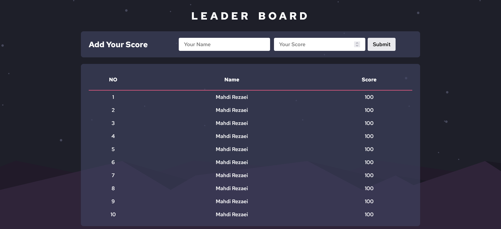
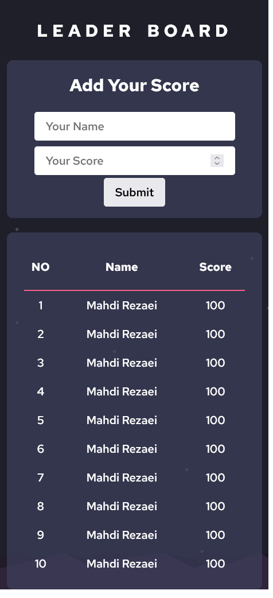

# Leader Board - JavaScript Project
## Table of contents

- [Overview](#overview)
  - [The challenge](#the-challenge)
  - [Screenshot](#screenshot)
  - [Links](#links)
- [Project Setup](#Setup-Project)
  - [commands](#command)
- [My process](#my-process)
  - [Built with](#built-with)
  - [What I learned](#what-i-learned)
  - [Continued development](#continued-development)
  - [Useful resources](#useful-resources)
- [Author](#author)
- [Acknowledgments](#acknowledgments)


## Overview

### The challenge

- Create a new game with the name of your choice by using the API.
- Make sure that you saved the ID of your game that will be returned by API.
- Implement the "Refresh" button that will get all scores for a game created by you from the API (receiving data from the API and parsing the JSON).
- Implement the form "Submit" button that will save a score for a game created by you (sending data to the API).
- Use arrow functions instead of the function keyword.
- Use async and await JavaScript features to consume the API

## Setup Project
### commands
In order to run this project locally in your machine follow the following steps

```
git clone https://github.com/MahdiSohaily/Leaderboard.git
cd Todo-app
npm install
npm run dev
npm run start
```

### Screenshot

| Desktop version                              |               Mobile Version                |
| -------------------------------------------- | :-----------------------------------------: |
|  |  |

### Links

- Live Site URL: [See Demo](https://mahdisohaily.github.io/Leaderboard/)

## My process

### Built with

- Semantic HTML5 markup
- CSS custom properties
- Flexbox
- CSS Grid
- Mobile-first workflow
- Webpack 5
- JavaScript

## Author

- Frontend Mentor - [@MahdiSohaily](https://www.frontendmentor.io/profile/MahdiSohaily)
- Twitter - [@Mahdi_Rezaei_AF](https://twitter.com/Mahdi_Rezaei_AF)
- linkedIn - [@Mahdi-rezaei](https://www.linkedin.com/in/mahdi-rezaei-74705713b)

prompt for home tab

Modify the project to create a fully detailed and professional "Home" tab that acts as an introduction page for new users, while keeping the same sleek design style as the Rankings page.

Requirements:

1. **Default Behavior**
- The site must load on the "Home" tab by default.
- The "Rankings" tab should only show leaderboard content when clicked.

2. **Home Tab Layout (IMPORTANT)**
- The Home page must be clean, organized, and visually similar to the Rankings page (same theme, spacing, and style).
- Use sections/cards with clear spacing and smooth animations.

3. **Gamemode Section with SVGs**
- Display all gamemode SVGs from the `tabs` folder.
- For each SVG, include:
  - Gamemode name (e.g. Vanilla, UHC, Pot, Nethop, SMP, Sword, Axe, Mace, LTM)
  - A detailed description of what that PvP mode is
  - Explain how it works and what makes it unique

Example:
- Vanilla (CPvP): Explain crystal PvP mechanics, timing, positioning, and skill ceiling
- UHC: Explain rod usage, bow pressure, healing limitations
- Pot: Explain potion management, refill speed, aggression
- etc.

4. **Tier System Explanation (DETAILED)**
- Add a full section explaining how the tier system works.

Include:
- What tiers mean (LT5 → HT1 progression)
- Difference between Low Tier (LT) and High Tier (HT)
- Explanation of skill levels and ranking logic
- Why tiers matter and how players are evaluated

Make this section detailed, structured, and easy to understand but still somewhat complex.

5. **Tier Testing System (VERY IMPORTANT)**
- Create a detailed section explaining how tier testing works.

Include:
- Players must 1v1 a player who is already in the desired tier
- Evaluation is based on performance, consistency, and mechanics
- Explain how testers judge skill level

Make this explanation:
- Long
- Structured
- Professional
- Slightly complex (not overly simple)

6. **How to Get Tier Tested (Discord Section)**
- Add a section explaining how to get tested.

Include:
- Join the Discord server
- Open a ticket or request a test
- Wait for a tester/moderator
- Play matches and get evaluated

Make this section:
- Detailed
- Step-by-step
- Realistic and clear
- Include possible delays, fairness, and rules

7. **Additional Sections (IMPORTANT)**
Add extra sections to make the site feel complete:

- “How Rankings Work”
  → Explain how points/rankings are calculated

- “Top Players”
  → Placeholder section highlighting top players

- “Rules & Fair Play”
  → No cheating, no boosting, fair matches only

- “Updates / Changes”
  → Placeholder for future updates

8. **Design Requirements**
- Match the same style as Rankings:
  - Same fonts
  - Same dark/light theme
  - Same spacing and card layout
- Add:
  - Smooth hover effects
  - Subtle animations (fade/slide)
  - Clean UI hierarchy

9. **Performance**
- Do NOT load leaderboard data on Home tab
- Keep everything fast and smooth

10. **Important Restrictions**
- Use ONLY the SVGs from the `tabs` folder
- DO NOT modify or recolor the SVGs
- Keep them exactly as provided

11. **Output**
- Fully working implementation (HTML, CSS, JS)
- Clean structure with reusable components
- Add comments explaining:
  - Each section
  - How to edit text
  - How to add new gamemodes or sections

**Goal:**
Create a polished and professional Home page that clearly explains the leaderboard, gamemodes, tier system, and testing process, using a structured layout and matching the visual quality of the Rankings page.
